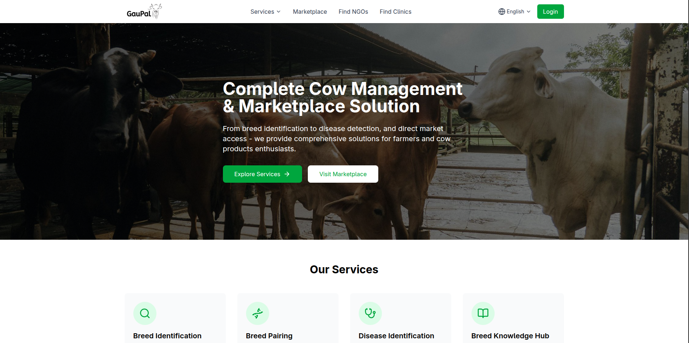
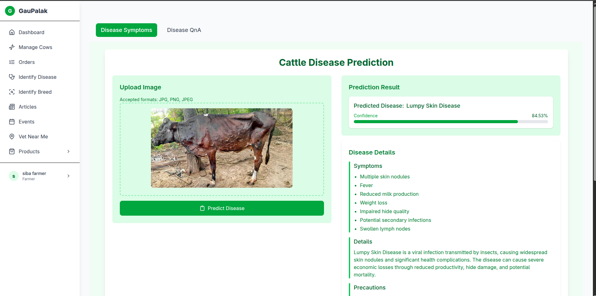
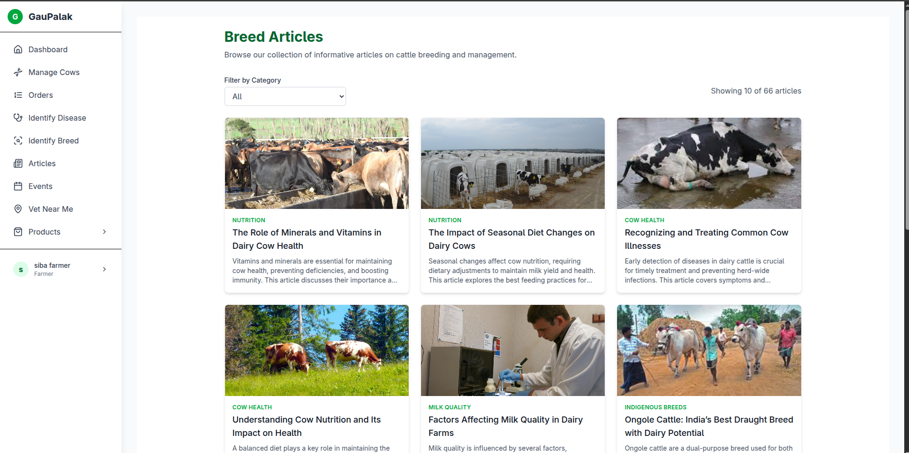
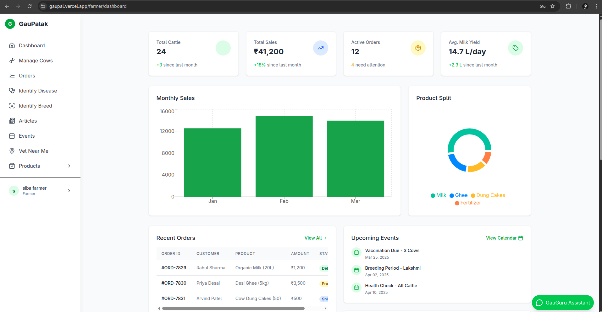
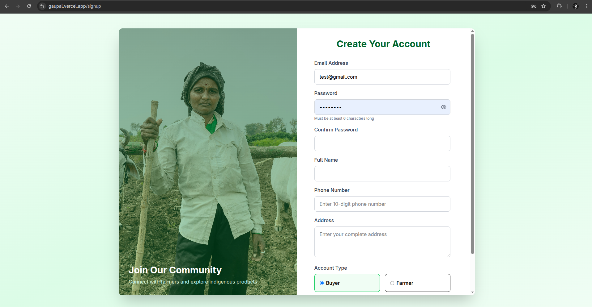

# GauPal

**GauPal** is an AI-powered digital platform designed to conserve indigenous Indian cow breeds. It integrates artificial intelligence, computer vision, genetic optimization, and multilingual support to empower farmers, boost biodiversity, and facilitate sustainable agriculture.

---

## 🌟 Highlights

* **Cow Breed Identification & Health Tracking** using AI & image processing
* **Smart Genetic Breeding** through advanced optimization algorithms
* **Educational Content** in regional languages with gamification features
* **Direct-to-Consumer Marketplace** for organic & Ayurvedic cow-based products
* **Real-Time Disease Detection** using EfficientNetB3 CNN models
* **Farmer Assistance** via Gemini AI chatbot and voice/WhatsApp support

---

## 📂 Project Structure

```
Gaupal/
├── Frontend/                 # React + TailwindCSS client application
│   ├── public/               # Static assets
│   ├── src/
│   │   ├── components/       # UI components
│   │   ├── layouts/          # Page layouts
│   │   ├── pages/            # Route components
│   │   ├── services/         # API services
│   │   ├── store/            # Redux store
│   │   └── utils/            # Utility functions
├── Server/                   # Node.js backend with Firebase integration
│   ├── controller/           # API controllers
│   ├── Routes/               # API route definitions
│   ├── ChatBot/              # Gemini AI integration
│   └── utils/                # Backend utilities
├── Models/                   # ML models (EfficientNet, XGBoost, etc.)
│   ├── breed-identification/ # Breed identification model
│   ├── breeding_model/       # Breeding recommendation model
│   ├── disease_identify/     # Disease detection model
│   └── disease-qna/          # Disease Q&A model
├── assets/                   # Project images and assets
└── requirements.txt          # Python dependencies for ML models
```

---
## ⚙️ Technologies Used

### Frontend
* **Framework**: React 19, Vite
* **Styling**: TailwindCSS, CSS Modules
* **State Management**: Redux Toolkit
* **Routing**: React Router v7
* **Maps**: React Google Maps API
* **UI Components**: ShadCN UI, Lucide React, Framer Motion
* **Data Visualization**: Recharts
* **Markdown Rendering**: React Markdown
* **Icons**: React Icons, Lucide React

### Backend
* **Runtime**: Node.js
* **Framework**: Express.js
* **Database**: Firebase Firestore
* **Authentication**: Firebase Auth
* **File Storage**: Firebase Storage
* **Cloud Services**: Google Cloud Platform (Vertex AI, Cloud Storage)
* **APIs**: Google Places, Google Translate, Gemini AI

### Machine Learning & AI
* **Computer Vision**: EfficientNetB3, MobileNetV2/V3
* **Disease Detection**: CNN models for image-based diagnosis
* **Ensemble Learning**: Voting classifiers for symptom-based prediction
* **Genetic Algorithms**: For breeding recommendations
* **NLP**: Gemini AI for chatbot functionality
* **ML Frameworks**: TensorFlow, Scikit-learn, XGBoost

### Development Tools
* **Build Tool**: Vite
* **Code Quality**: ESLint
* **Containerization**: Docker
* **Deployment**: Vercel (Frontend), Google Cloud Run (ML models)

---
<p float="left">
  
  
</p>

## 🚀 Setup Instructions

### 🔧 Prerequisites

* Node.js >= 16.x
* npm >= 8.x
* Firebase CLI (optional, if deploying manually)
* Google Cloud credentials (if using GCP APIs)

### 🔑 .env Configuration

Create a `.env` file in both the `Frontend/` and `Server/` directories.


### 1️⃣ Frontend Setup

```bash
cd Frontend
npm install       # Install dependencies
npm run dev       # Start frontend dev server
```

### 2️⃣ Backend Setup

```bash
cd Server
npm install       # Install dependencies
npm run dev       # Start backend server
```

---

## 📦 Models Directory

The `Models/` folder contains trained machine learning models for:

* Cow Breed Classification (EfficientNetB3)
* Disease Detection
* Genetic Optimization (XGBoost)

Ensure these models are either downloaded locally or connected to GCP Cloud Storage.

<p float="left">
  
  
</p>

---

## 🤖 AI & Machine Learning Models

### 1. Breed Identification Model
* **Architecture**: MobileNetV2
* **Classes**: 41 Indian cattle breeds
* **Input**: 224x3 RGB images
* **Output**: Breed name with confidence score

### 2. Breeding Recommendation Model
* **Approach**: Genetic Algorithm for feature selection + Random Forest
* **Function**: Recommends compatible bulls for breeding
* **Features**: Considers breed, health, physical traits

### 3. Disease Detection Model
* **Architecture**: EfficientNetB3 and MobileNetV3
* **Input**: Cattle disease images
* **Output**: Disease classification with confidence

### 4. Symptom-Based Disease Prediction
* **Approach**: Ensemble Learning (Decision Tree, Random Forest, KNN)
* **Classes**: 26 cattle diseases
* **Features**: 93 different symptoms
* **Output**: Predicted disease based on symptoms

---

## 📱 User Roles

### Farmer
* Manage cattle inventory and health records
* Access breeding recommendations
* List and sell products
* Track orders and revenue
* Monitor cattle health and vaccination schedules

### Buyers
* Browse cattle breeds and educational content
* Identify Different Cattle Breeds
* Access disease information and prevention tips
* View Breed Database
* Locate Nearby NGO's and Gaushalas
* View articles and resources

---

## 🌐 Deployment

### Frontend (Vercel)
1. Push code to GitHub repository
2. Connect Vercel account to repository
3. Set environment variables in Vercel dashboard
4. Deploy automatically on push

### Backend (Google Cloud)
1. Deploy Express server to Google Cloud Run
2. Configure Firebase project
3. Set up domain and SSL certificate
4. Configure environment variables

### ML Models (Docker)
1. Containerize each model
2. Push to container registry
3. Deploy to cloud platform
4. Configure load balancing if needed

---

## 🔮 Future Features

* Voice AI-based helpline via Twilio + Dialogflow
* WhatsApp voice assistant for rural outreach
* Blockchain-based cattle lineage tracking
* AI-powered feed/nutrition planner

<p float="left">
  
</p>


Empowering farmers. Preserving heritage. Promoting sustainability.

> GauPal: The smart way to care for India’s native cows. 🫀


© 2024 NeoCoders. All rights reserved.  
This software is proprietary and may not be used, copied, modified, or distributed without permission.
