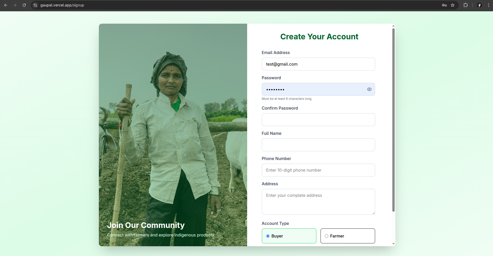

# Gaupal

**Gaupal** is an AI-powered digital platform designed to conserve indigenous Indian cow breeds. It integrates artificial intelligence, computer vision, genetic optimization, and multilingual support to empower farmers, boost biodiversity, and facilitate sustainable agriculture.

---

## 🌟 Highlights

* **Cow Breed Identification & Health Tracking** using AI & image processing
* **Smart Genetic Breeding** through advanced optimization algorithms
* **Educational Content** in regional languages with gamification features
* **Direct-to-Consumer Marketplace** for organic & Ayurvedic cow-based products
* **Real-Time Disease Detection** using EfficientNetB3 CNN models
* **Farmer Assistance** via Gemini AI chatbot and voice/WhatsApp support

---

## 📂 Project Structure

```
Gaupal/
├── Frontend/         # React + TailwindCSS client application
├── Server/           # Node.js backend with Firebase integration
├── Models/           # ML models (EfficientNet, XGBoost, etc.)
```

---

## ⚙️ Technologies Used

* **Frontend**: React, TailwindCSS, Vite
* **Backend**: Node.js, Express.js, Firebase Firestore
* **Authentication**: Firebase Auth
* **ML/AI**: Google ML Kit, EfficientNetB3, Vertex AI, XGBoost, Gemma
* **Cloud**: Google Cloud Run, GCP API Gateway, Firebase, Cloud Storage
* **APIs**: Google Places, Google Translate, Gemini AI Chatbot
* **Dev Tools**: Google IDX, Chart.js, Vercel

---
<p float="left">
  
  
</p>

## 🚀 Setup Instructions

### 🔧 Prerequisites

* Node.js >= 16.x
* npm >= 8.x
* Firebase CLI (optional, if deploying manually)
* Google Cloud credentials (if using GCP APIs)

### 🔑 .env Configuration

Create a `.env` file in both the `Frontend/` and `Server/` directories.


### 1️⃣ Frontend Setup

```bash
cd Frontend
npm install       # Install dependencies
npm run dev       # Start frontend dev server
```

### 2️⃣ Backend Setup

```bash
cd Server
npm install       # Install dependencies
npm run dev       # Start backend server
```

---

## 📦 Models Directory

The `Models/` folder contains trained machine learning models for:

* Cow Breed Classification (EfficientNetB3)
* Disease Detection
* Genetic Optimization (XGBoost)

Ensure these models are either downloaded locally or connected to GCP Cloud Storage.

<p float="left">
  
  
</p>

---

## 🔮 Future Features

* Voice AI-based helpline via Twilio + Dialogflow
* WhatsApp voice assistant for rural outreach
* Blockchain-based cattle lineage tracking
* AI-powered feed/nutrition planner

<p float="left">
  
</p>


Empowering farmers. Preserving heritage. Promoting sustainability.

> GauPal: The smart way to care for India’s native cows. 🫀


© 2024 NeoCoders. All rights reserved.  
This software is proprietary and may not be used, copied, modified, or distributed without permission.
